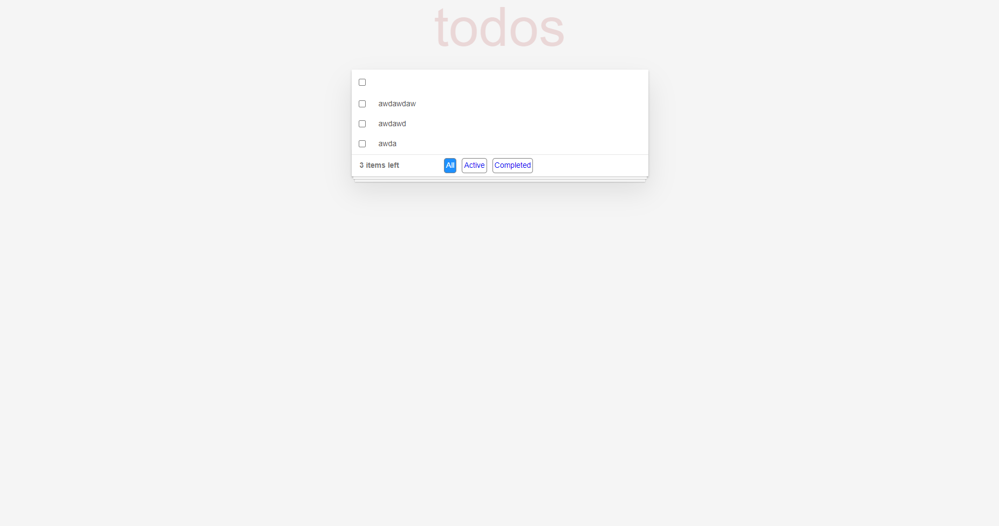

# Todo With Recoil（⚡️）

⚡️ Code Challente Frontend Engineer.

## Libraries

- ⚡️ Vite - Bundle Frontend Tooling.
- 🎡 React Table - Hooks for building lightweight, fast and extendable datagrids for React.
- 📑 Recoil - A state management library for React.
- 🧩 typescript - Types for JS.
- 😎 Recoil Persist - Tiny module for recoil to store and sync state to Storage.

## Preview

[](https://todo-list-recoil-haqj.vercel.app/)

## Getting Started

```bash
npm i
npm run dev
```

### Prerequisites

- `npm` and `pnpm` should be installed.
- `git` should be installed (recommended v2.4.11 or higher)
